()

# Machine Learning project on Kickstarter campaign success prediction

Our team would like to apply our machine learning skills to predict whether a Kick Starter project would be successfully funded based on the project category, launching month, duration, project location and the goal USD of the project.  

Data is from kaggle dataset: https://www.kaggle.com/yashkantharia/kickstarter-campaigns

## Table of Contents

- [Project background & aim](#Project_background_and_aim)
- [Data Collection](#Data_Collection)
- [Data Preprocessing](#Data_Preprocessing)
- [Model 1: Classification model](#Model_1:_Classification_model)
- [Model 2: Regression model](#Model_2:_Regression_model)
- [Conclusion](#Conclusion)
- [Challenge](#Challenge)
- [Room for Improvement & future application](#Room_for_Improvement_and_future_application)

## Project_background_and_aim

Starting a new venture and put your creative idea into real life can be exciting yet hard to complete as lack of capital. The global crownfunding platform KickStarter may create a great opportunity for you to make your dream come true. However, you may still hesitate as do not know if others also see your project as feasible and can get enough fund from the crownfunding.  

In this project, our team will act as a group of consultants in Kickstarter who would like to use Machine Learning models to predict whether the startup projects would be successfully funded.  

By developing a Campaign Success predictor to predict whether the project would successfully funded base on the project category, US/ Non-US country, release time and the goal USD of the project, would provide some direction for young entrepreneur and increase the success rate of start up projects.  

We would also like to further investigate if we would predict how much the project would be funded based on the project category, US/ Non-US country and release time to provide a guideline for our clients. 

## Data_Collection
Our dataset is from Kaggle, with 170K project entries (after cleaning duplicates) labeled as 'successful' or 'failed' as the crown funding 'status'. Also the amount of money funded is shown in USD dollars in 'USD pledge'.  

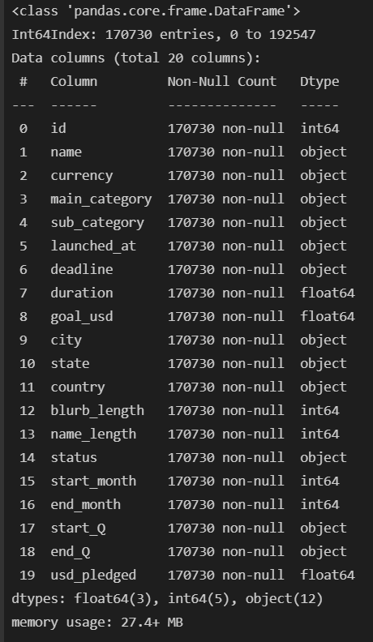

In data preprocessing, duplicated data was dropped and there 

## Data_Preprocessing

### Imbalance of data
All projects labeled where the project based, classified into 15 categories and further to 159 sub-categories. However, there is a imbalance in data as majority of the projects are US-based and some sub-categories may not be very popular. The imbalance in data will easily affect our model prediction.  

#### Count plot for project based
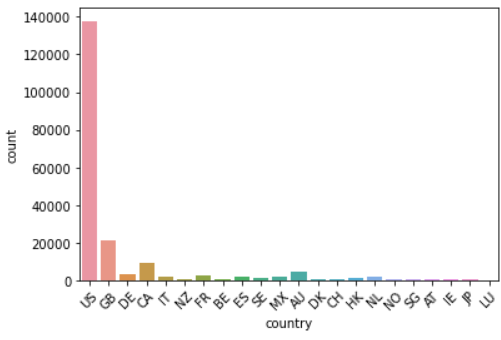

#### Count plot for sub-category
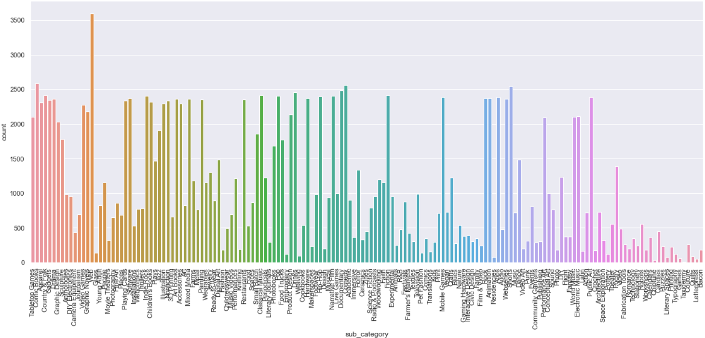

Therefore, we decided to grouped all countries except US to Non-US based to have a better balance in data. For category, we only take main category to build the model.  

#### Count plot for project based - US or Non-US based
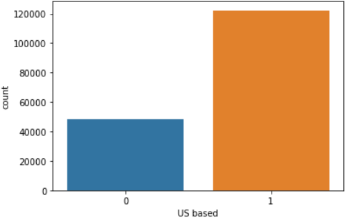

#### Count plot for main-category

### Bivariate analysis 

The crownfunding will consider as successful if the USD pledged online excess the goal of the funding. From the graph, it is obvious that the failed projects normally set an unrealistic high goal.   

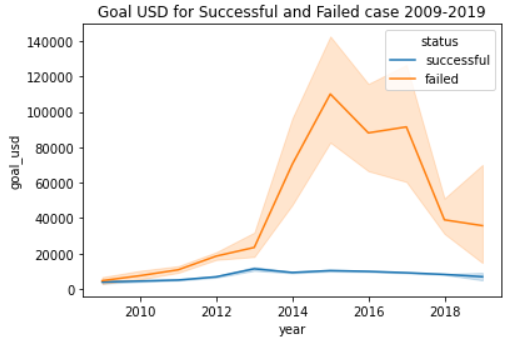

The differerce in main category will also have different rate of success in crown funding.   

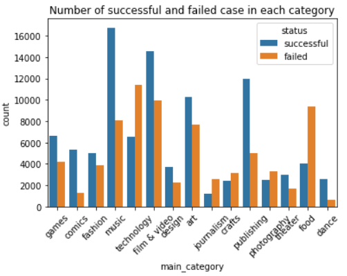

Successful projects normally complete earlier than failed projects.   

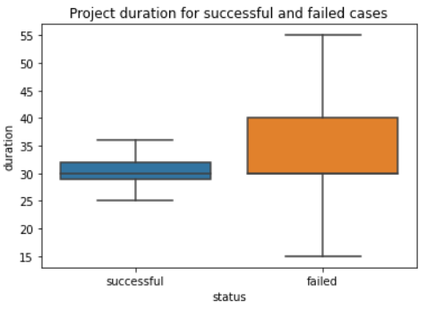

The final dataset for model develop. Categorical data will be one-hot encoded and numerical data will be normalized.   
Model 1: Classification model   
- predict whether the project can be successfully funded  
- Dependent variable: status  
- Independent variable: main_category, duration, goal_usd, country, start_month  

Model 2: Regression model   
- predict how much the project can be funded  
- Dependent variable: usd_pledged  
- Independent variable: main_category, duration, goal_usd, country, start_month  

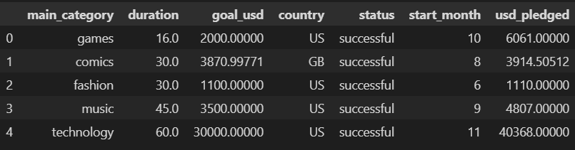

## Model_1:_Classification_model
We developed three classification model, Logistic Regression, Random Forest Classifier and XGBoost Classifier with the below model performance.   

In general, XGBoost Classifier better predict the sucessfulness of the project while Random Forest Classifier are slightly more sensitive to positive event as it has a higher recall. Since we would like to know the failure of project in a earlier stage. We chose the XGBoost model for the prediction.   

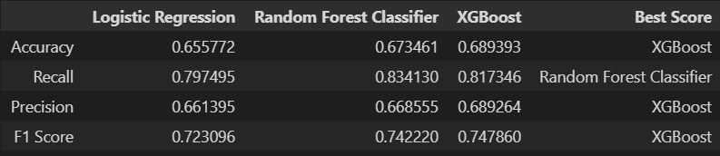

After fine tuning the XGBoost model, we developed the model at max-depth of 4 with accuracy of 0.69.  

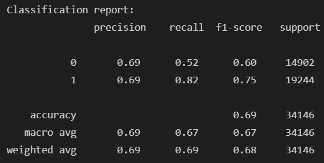

## Model_2:_Regression_model

Since the successfulness of crown funding largely depend affected by whether the funding goal will match the public expectation. We would like to develop regression models to predict the amount of fund that can be raised.  

We tried Linear Regression model and Decision Tree Regression model. However, both models perform bad with low variance score of 0.017 and 0.028. It may because based on the current data, it is not sufficient to explain and predict the USD pleged from the crownfunding.  

### Linear Regression model performance 
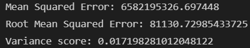

### Decision Tree Regression model performance 
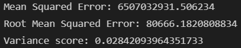

## Conclusion
As a conclusion, we chose the XGBoost model with parameter of max_depth = 4 for the prediction of the successfulness of the kickstarter projects.  

For the amount of USD pledged, since there is no suitable model for the prediction, more research and data will be needed to give a reliable suggestion on the goal amount for the project team to target on.  

## Challenge
1. Number of sub-category  
- The KickStarter classified the projects into 159 sub-categories. Due to hardware problem and imbalance of data, we are unable to use the feature for the model.  

2. Insufficient data for regression model 
- More features of the projects may required to find the relationship with the amount of USD that can be funded as the current dataset is not sufficient to develop a realiable regression model. 

## Room_for_Improvement_and_future_application
Since time is restricted in the project, we are unable to find a suitable model for the regression prediction. We would suggest to find out more features about the projects to understand how other people value a kickstarter projects. 

A more accurate classification model on the successfulness and a reliable regression model on the amount of fund prediction would helps young entrepreneurs know better about their projects and increase the rate of success.  
